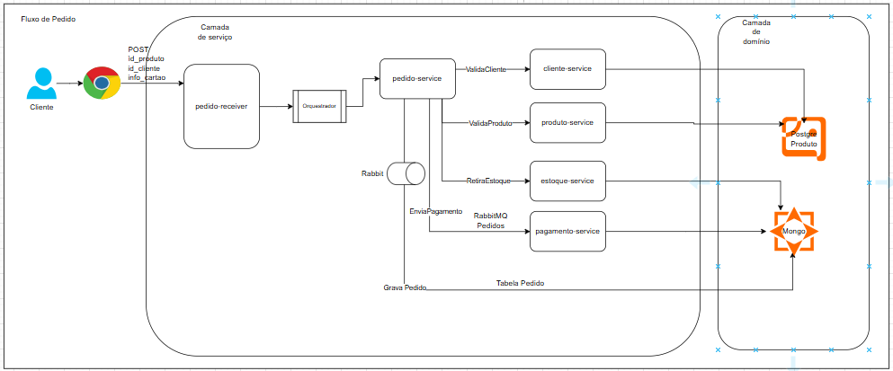

# toy-store-compose

# Toystore - Ambiente Local com Docker Compose

Este projeto configura todo o ambiente necessário para a execução do ecossistema Toystore utilizando Docker Compose.

## 💪 Requisitos

* Docker
* Docker Compose

---

## 🚀 Serviços Disponíveis

| Serviço      | Porta Local | Container                |  Swagger
|--------------|-------------|--------------------------|-------------------------------------------------------|
| PostgreSQL   | 5432        | postgres-toy-store       |  N/A  |
| MongoDB      | 27017       | mongo-toy-store          |  N/A  |
| RabbitMQ     | 5672 / 15672| rabbitmq-toy-store       |  N/A  |
| Pagamento    | 8081        | toy-store-pagamento      | http://localhost:8081/swagger-ui/index.html#/         |
| Estoque      | 8082        | toy-store-stock          | http://localhost:8082/stock/swagger-ui/index.html#    |
| Cliente      | 8083        | toystore-customer-app    | http://localhost:8083/customer/swagger-ui/index.html# |
| Produto      | 8084        | toy-store-product        | http://localhost:8084/swagger-ui/index.html#          |
| Pedido       | 8080        | pedido-service           | http://localhost:8080/pedido/swagger-ui/index.html    |

## 🔧 Como Usar

1. Clone este repositório:

```bash
git clone https://github.com/ViniCampos/toy-store-compose.git
```

2. Clone este repositório:
```bash
docker-compose up -d
docker ps
docker-compose down

```

## 📂 Estrutura dos Containers

| Container             | Imagem                                  |
| --------------------- | --------------------------------------- |
| postgres-toy-store    | postgres                                |
| mongo-toy-store       | mongo                                   |
| rabbitmq-toy-store    | rabbitmq\:management                    |
| toy-store-pagamento   | 1moninfernando/toy-store-apppag:1.5     |
| app-toy-store-stock   | majorv22/toy-store-stock:1.0            |
| toystore-customer-app | evaldofires/toystore-customer-app:1.0.2 |
| app-toy-store-product | fakynno/toy-store-product:1.0           |
| pedido-service        | marcelonidal/pedido-service\:latest     |

## 📅 Ordem de Inicialização dos Containers

A inicialização respeita a dependência entre os serviços:

1. PostgreSQL
2. MongoDB
3. RabbitMQ
4. Microsserviços dependentes (Pagamentos, Estoque, Cliente, Produto, Pedido)

## 🔍 Notas

* Banco **PostgreSQL** cria automaticamente a base `pedidos`.
* **RabbitMQ** usa credenciais padrão: `guest` / `guest`.
* Todos os containers estão na rede Docker `toystorerede`.

## Sobre o projeto
### Desenho de arquitetura


